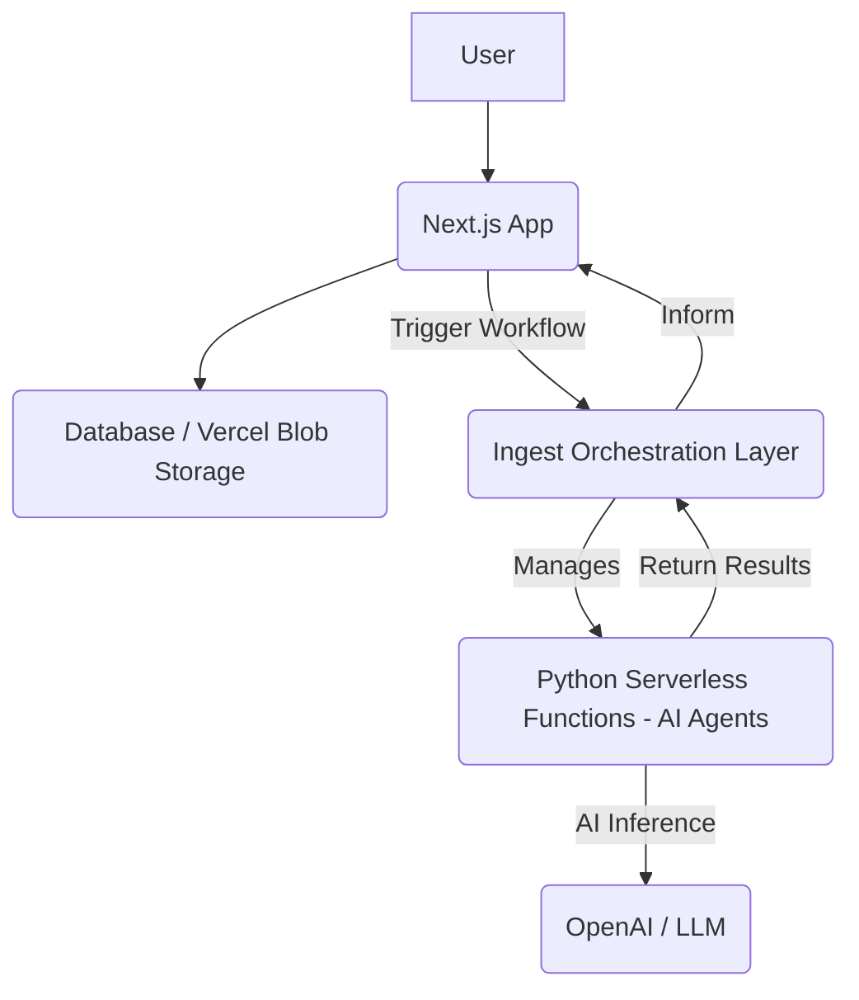

From: [[aidotengineer]]   

Deploying modern AI engineering workloads in a serverless environment requires selecting the right tools to build a robust, scalable, and user-ready application <a class="yt-timestamp" data-t="00:00:14">[00:00:14]</a>. The combination of Next.js for the client application and Vercel for the serverless deployment environment offers a powerful and integrated solution <a class="yt-timestamp" data-t="00:02:49">[00:02:49]</a>. This setup helps achieve [[zero_ops_resilient_agent_powered_apps | zero ops resilient agent-powered user-ready apps]] <a class="yt-timestamp" data-t="00:00:19">[00:00:19]</a>.

## Recommended Stack Components

A full stack AI engineering workload typically involves a client application, an agent framework, and an orchestration layer, all running serverlessly in the cloud <a class="yt-timestamp" data-t="00:00:46">[00:00:46]</a>. The favored combination for this type of deployment is:

*   **Client App:** Next.js <a class="yt-timestamp" data-t="00:03:12">[00:03:12]</a>
*   **Agent Framework:** OpenAI Agents SDK <a class="yt-timestamp" data-t="00:03:16">[00:03:16]</a>
*   **Orchestration Layer:** Ingest <a class="yt-timestamp" data-t="00:03:53">[00:03:53]</a>
*   **Serverless Environment:** Vercel <a class="yt-timestamp" data-t="00:04:18">[00:04:18]</a>

## Next.js for Client Applications

Next.js is a strong choice for the client application due to its robust features <a class="yt-timestamp" data-t="00:03:12">[00:03:12]</a>:
*   **Built-in Streaming:** Facilitates efficient data handling. <a class="yt-timestamp" data-t="00:02:58">[00:02:58]</a>
*   **First-class Server Actions:** Enables server-side logic directly within components. <a class="yt-timestamp" data-t="00:03:01">[00:03:01]</a>
*   **File-based and Nested Routing:** Simplifies application structure and navigation. <a class="yt-timestamp" data-t="00:03:04">[00:03:04]</a>
*   **Deep Integration with Vercel:** Next.js, being developed by Vercel, ensures seamless deployment and performance optimizations <a class="yt-timestamp" data-t="00:03:06">[00:03:06]</a>. This strong alignment makes Vercel the ideal cloud platform for Next.js infrastructure <a class="yt-timestamp" data-t="00:05:07">[00:05:07]</a>.

## Vercel for Serverless Hosting

Vercel provides an exceptional serverless environment for deploying Next.js applications and other serverless functions <a class="yt-timestamp" data-t="00:04:18">[00:04:18]</a>:
*   **Preview Deployments:** Every push to a repository automatically triggers a preview deployment, integrating continuous deployment into the workflow and allowing teams to review changes on preview branches <a class="yt-timestamp" data-t="00:04:21">[00:04:21]</a>.
*   **Automatic Deployments:** Vercel deploys the application automatically upon merging to the main branch <a class="yt-timestamp" data-t="00:04:42">[00:04:42]</a>.
*   **Strong Edge Network & CDNs:** Provides high performance and low latency globally with automatic Content Delivery Networks <a class="yt-timestamp" data-t="00:04:50">[00:04:50]</a>.
*   **Integrated Database Options:** Offers various database integrations including PostgreSQL, Redis, and blob storage <a class="yt-timestamp" data-t="00:04:55">[00:04:55]</a>.

## Architecture and Workflow

The core architecture involves a Next.js application that interacts with an orchestration layer (Ingest) which, in turn, manages serverless Python functions running AI agents (OpenAI Agents SDK) <a class="yt-timestamp" data-t="00:06:00">[00:06:00]</a>.

*   **Client Interaction:** Users connect to the Next.js app, which might check a database for cached results <a class="yt-timestamp" data-t="00:06:02">[00:06:02]</a>.
*   **Workflow Trigger:** If new work is needed, the Next.js app triggers a new workflow by sending an event to the Ingest service <a class="yt-timestamp" data-t="00:06:11">[00:06:11]</a>.
*   **Orchestration:** Ingest manages the connection to Python serverless functions, where the AI agents are running <a class="yt-timestamp" data-t="00:06:17">[00:06:17]</a>.
*   **AI Agent Execution:** Vercel automatically hosts these Python functions (e.g., Fast API apps), allowing them to handle AI inference by communicating with OpenAI <a class="yt-timestamp" data-t="00:06:34">[00:06:34]</a>.
*   **Result Handling:** Results are returned to the orchestration layer, which then informs the front end. Data can be cached in the database as needed <a class="yt-timestamp" data-t="00:06:50">[00:06:50]</a>.

This setup ensures serverless scalability, the ability to support long-running jobs without hitting cloud function time limits, and cost efficiency by paying only for actual usage <a class="yt-timestamp" data-t="00:07:34">[00:07:34]</a>.

## Development and Deployment

For local development, three terminals are typically used: one for Python agents, one for Next.js, and one for the Ingest dev server <a class="yt-timestamp" data-t="00:08:13">[00:08:13]</a>.

Deployment to Vercel is streamlined:
*   **Automatic Recognition:** Vercel automatically picks up Python functions in a top-level `api` directory and deploys each file as its own independent cloud function, without needing a `vercel.json` config file <a class="yt-timestamp" data-t="00:11:57">[00:11:57]</a>.
*   **Vercel CLI:** The `vercel` CLI command allows signing in, connecting to environment variables, and pulling down production environment variables to run locally <a class="yt-timestamp" data-t="00:16:39">[00:16:39]</a>.
*   **Environment Variables:** Essential environment variables typically include an OpenAI API key and a Vercel blob storage token <a class="yt-timestamp" data-t="00:16:50">[00:16:50]</a>.
*   **Observability:** Vercel provides full build logs and displays how API agents are deployed as Python functions, aiding in troubleshooting <a class="yt-timestamp" data-t="00:15:58">[00:15:58]</a>.

This integrated approach facilitates a smooth developer experience with full type safety across Python (with Pydantic) and TypeScript (with Next.js) <a class="yt-timestamp" data-t="00:08:03">[00:08:03]</a>.