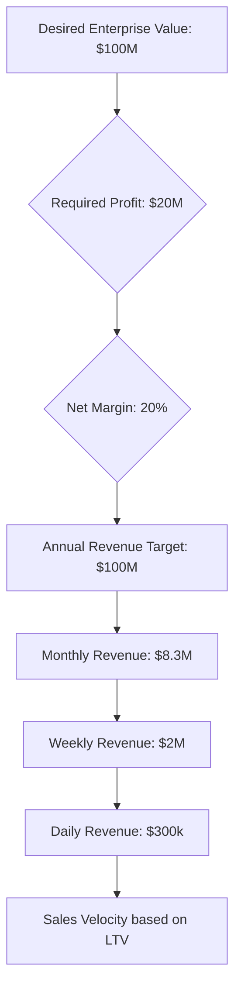

From: [[alexhormozi]]   

For those aiming for a $100 million enterprise value, the path does not necessarily require groundbreaking inventions or highly complex ventures <a class="yt-timestamp" data-t="00:00:05">[00:00:05]</a>. Unlike the pursuit of $100 billion, which might necessitate creating "the next Google" <a class="yt-timestamp" data-t="00:00:18">[00:00:18]</a>, a $100 million valuation is achievable with virtually "any business" <a class="yt-timestamp" data-t="00:00:21">[00:00:21]</a>. This perspective fosters an [[entrepreneurship_and_business_growth_mindset|entrepreneurial mindset]] focused on practical calculation and execution rather than radical innovation <a class="yt-timestamp" data-t="00:00:05">[00:00:05]</a>.

## The Reverse-Engineering Approach

Achieving a $100 million enterprise value requires a clear understanding of financial metrics and the ability to reverse-engineer revenue targets <a class="yt-timestamp" data-t="00:01:11">[00:01:11]</a>. The speaker illustrates this with a simple house cleaning business example <a class="yt-timestamp" data-t="00:00:28">[00:00:28]</a>:

*   **Customer Lifetime Value (LTV)**: Determine how long an average customer stays (e.g., 2 years based on industry stats) and their monthly payment (e.g., $400) <a class="yt-timestamp" data-t="00:00:31">[00:00:31]</a>.
*   **Net Margins**: Identify the industry average net margins (e.g., 20%) <a class="yt-timestamp" data-t="00:00:37">[00:00:37]</a>.
*   **Profit Target**: To reach a $100 million valuation, a business might need to generate $12-15 million in profit, or $20 million to be safe, considering market multiples <a class="yt-timestamp" data-t="00:00:40">[00:00:40]</a>.
*   **Revenue Calculation**: With a 20% net margin, $20 million in profit means the business needs to achieve $100 million in annual revenue <a class="yt-timestamp" data-t="00:00:52">[00:00:52]</a>.
*   **Sales Velocity**: Break down the annual revenue target into smaller, manageable daily sales goals. $100 million annually translates to $8.3 million per month, approximately $2 million per week, or about $300,000 per day <a class="yt-timestamp" data-t="00:00:54">[00:00:54]</a>.

> "And so then you just back in sales velocity to the 300,000 a day on LTV and that's pretty much how I derive almost every business model that I come up with" <a class="yt-timestamp" data-t="00:01:04">[00:01:04]</a>

This methodical approach to reverse-engineering sales velocity from a desired enterprise value is a core [[strategies_for_entrepreneurial_success|strategy for entrepreneurial success]] <a class="yt-timestamp" data-t="00:01:11">[00:01:11]</a>. By breaking down large financial goals into actionable daily targets, entrepreneurs can focus on the steps needed to scale their operations, whether they are just starting out or aiming for significant growth beyond [[the_challenges_of_making_the_first_100k|their first 100k]] <a class="yt-timestamp" data-t="00:01:04">[00:01:04]</a>.

## Key Metrics for Valuation

This systematic process involves understanding:
*   How much money needs to be sold daily <a class="yt-timestamp" data-t="00:01:14">[00:01:14]</a>.
*   The worth of each customer (LTV) <a class="yt-timestamp" data-t="00:01:15">[00:01:15]</a>.
*   The total revenue generated <a class="yt-timestamp" data-t="00:01:17">[00:01:17]</a>.
*   The margin on that revenue <a class="yt-timestamp" data-t="00:01:19">[00:01:19]</a>.
*   The multiple on that margin to determine the business's worth <a class="yt-timestamp" data-t="00:01:21">[00:01:21]</a>.