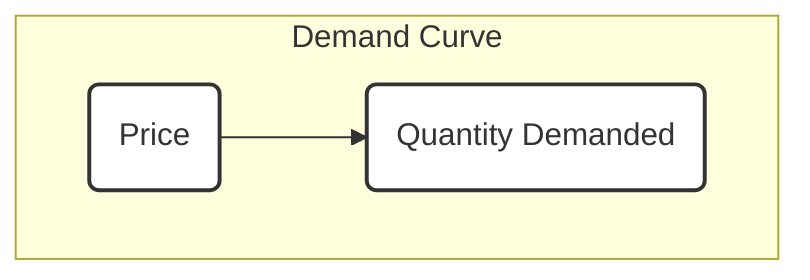

From: [[khanacademy]] <br/> 

The [[law_of_demand | law of demand]] is a core concept in microeconomics, stating that if the price of a product increases, the quantity demanded for that product will decrease, and conversely, if the price decreases, the quantity demanded will increase <a class="yt-timestamp" data-t="00:00:10">[00:00:10]</a>. While there are exceptions, this is a general principle <a class="yt-timestamp" data-t="00:00:36">[00:00:36]</a>.

## Demand vs. Quantity Demanded
It is crucial to distinguish between "demand" and "quantity demanded" in economics <a class="yt-timestamp" data-t="00:01:13">[00:01:13]</a>.
*   **Quantity Demanded**: Refers to a specific amount of a product that consumers are willing to buy at a given price, assuming all other factors remain equal (ceteris paribus) <a class="yt-timestamp" data-t="00:01:11">[00:01:11]</a>, <a class="yt-timestamp" data-t="00:07:16">[00:07:16]</a>. When only the price changes, the quantity demanded changes <a class="yt-timestamp" data-t="00:01:30">[00:01:30]</a>, <a class="yt-timestamp" data-t="00:08:02">[00:08:02]</a>.
*   **Demand**: Refers to the entire relationship between various prices and the quantities demanded at those prices, with all other factors held constant <a class="yt-timestamp" data-t="00:01:02">[00:01:02]</a>, <a class="yt-timestamp" data-t="00:07:30">[00:07:30]</a>. A change in demand would mean the entire relationship shifts, leading to a different demand curve or schedule <a class="yt-timestamp" data-t="00:07:39">[00:07:39]</a>.

## Demand Schedule
A demand schedule is a table that illustrates the relationship between the price of a product and its quantity demanded, assuming all other factors are constant <a class="yt-timestamp" data-t="00:02:02">[00:02:02]</a>, <a class="yt-timestamp" data-t="00:02:23">[00:02:23]</a>, <a class="yt-timestamp" data-t="00:04:05">[00:04:05]</a>.

### Example: "Space Whatever" Ebook
Consider the hypothetical demand for a science fiction ebook titled "Space Whatever":

| Scenario | Price ($) | Quantity Demanded (Units) |
| :------- | :-------- | :------------------------ |
| A        | 2         | 60,000                    |
| B        | 4         | 40,000                    |
| C        | 6         | 30,000                    |
| D        | 8         | 25,000                    |
| E        | 10        | 23,000                    |
<a class="yt-timestamp" data-t="00:02:54">[00:02:54]</a>

This table demonstrates the [[law_of_demand | law of demand]]: as the price increases, the quantity demanded decreases <a class="yt-timestamp" data-t="00:03:09">[00:03:09]</a>, <a class="yt-timestamp" data-t="00:03:21">[00:03:21]</a>, <a class="yt-timestamp" data-t="00:03:33">[00:03:33]</a>, <a class="yt-timestamp" data-t="00:03:49">[00:03:49]</a>.

## Demand Curve
A demand curve is a graphical representation of the demand schedule, plotting the relationship between price and quantity demanded <a class="yt-timestamp" data-t="00:04:14">[00:04:14]</a>. When plotting a demand curve in economics, price is conventionally placed on the vertical (y) axis, and quantity demanded is placed on the horizontal (x) axis <a class="yt-timestamp" data-t="00:05:04">[00:05:04]</a>, <a class="yt-timestamp" data-t="00:05:10">[00:05:10]</a>.

### Graphing the Demand Curve
Using the "Space Whatever" ebook example:

1.  **Axes Setup**:
    *   Vertical Axis (Price): Ranges from $2 to $10 <a class="yt-timestamp" data-t="00:05:41">[00:05:41]</a>.
    *   Horizontal Axis (Quantity Demanded): Ranges from 23,000 to 60,000 units <a class="yt-timestamp" data-t="00:05:21">[00:05:21]</a>.

2.  **Plotting Points**:
    *   Scenario A: ($2, 60,000) <a class="yt-timestamp" data-t="00:05:57">[00:05:57]</a>
    *   Scenario B: ($4, 40,000) <a class="yt-timestamp" data-t="00:06:05">[00:06:05]</a>
    *   Scenario C: ($6, 30,000) <a class="yt-timestamp" data-t="00:06:16">[00:06:16]</a>
    *   Scenario D: ($8, 25,000) <a class="yt-timestamp" data-t="00:06:26">[00:06:26]</a>
    *   Scenario E: ($10, 23,000) <a class="yt-timestamp" data-t="00:06:39">[00:06:39]</a>

3.  **Drawing the Curve**: A continuous line connecting these points forms the demand curve. The curve represents all possible price-quantity combinations, not just the specific scenarios in the table <a class="yt-timestamp" data-t="00:04:20">[00:04:20]</a>.



```
Price ($)
|
10 + . . . . . . . . . . . . . . . . . . . . . . . . . . . . . . . . . . . . . . . . . . . . . . . . . . . . . . . . . . . . . . . . . . . . . . . . . . . . . . . . . . . . . . . . . . . . . . . . . . . . . . . . . . . . . . . . . . . . . . . . . . . . . . . . . . . . . . . . . . . . . . . . . . . . . . . . . . . . . . . . . . . . . . . . . . . . . . . . . . . . . . . . . . . . . . . . . . . . . . . . . . . . . . . . . . . . . . . . . . . . . . . . . . . . . . . . . . . . . . . . . . . . . . . . . . . . . . . . . . . . . . . . . . . . . . . . . . . . . . . . . . . . . . . . . . . . . . . . . . . . . . . . . . . . . . . . . . . . . . . . . . . . . . . . . . . . . . . . . . . . . . . . . . . . . . . . . . . . . . . . . . . . . . . . . . . . . . . . . . . . . . . . . . . . . . . . . . . . . . . . . . . . . . . . . . . . . . . . . . . . . . . . . . . . . . . . . . . . . . . . . . . . . . . . . . . . . . . . . . . . . . . . . . . . . . . . . . . . . . . . . . . . . . . . . . . . . . . . . . . . . . . . . . . . . . . . . . . . . . . . . . . . . . . . . . . . . . . . . . . . . . . . . . . . . . . . . . . . . . . . . . . . . . . . . . . . . . . . . . . . . . . . . . . . . . . . . . . . . . . . . . . . . . . . . . . . . . . . . . . . . . . . . . . . . . . . . . . . . . . . . . . . . . . . . . . . . . . . . . . . . . . . . . . . . . . . . . . . . . . . . . . . . . . . . . . . . . . . . . . . . . . . . . . . . . . . . . . . . . . . . . . . . . . . . . . . . . . . . . . . . . . . . . . . . . . . . . . . . . . . . . . . . . . . . . . . . . . . . . . . . . . . . . . . . . . . . . . . . . . . . . . . . . . . . . . . . . . . . . . . . . . . . . . . . . . . . . . . . . . . . . . . . . . . . . . . . . . . . . . . . . . . . . . . . . . . . . . . . . . . . . . . . . . . . . . . . . . . . . . . . . . . . . . . . . . . . . . . . . . . . . . . . . . . . . . . . . . . . . . . . . . . . . . . . . . . . . . . . . . . . . . . . . . . . . . . . . . . . . . . . . . . . . . . . . . . . . . . . . . . . . . . . . . . . . . . . . . . . . . . . . . . . . . . . . . . . . . . . . . . . . . . . . . . . . . . . . . . . . . . . . . . . . . . . . . . . . . . . . . . . . . . . . . . . . . . . . . . . . . . . . . . . . . . . . . . . . . . . . . . . . . . . . . . . . . . . . . . . . . . . . . . . . . . . . . . . . . . . . . . . . . . . . . . . . . . . . . . . . . . . . . . . . . . . . . . . . . . . . . . . . . . . . . . . . . . . . . . . . . . . . . . . . . . . . . . . . . . . . . . . . . . . . . . . . . . . . . . . . . . . . . . . . . . . . . . . . . . . . . . . . . . . . . . . . . . . . . . . . . . . . . . . . . . . . . . . . . . . . . . . . . . . . . . . . . . . . . . . . . . . . . . . . . . . . . . . . . . . . . . . . . . . . . . . . . . . . . . . . . . . . . . . . . . . . . . . . . . . . . . . . . . . . . . . . . . . . . . . . . . . . . . . . . . . . . . . . . . . . . . . . . . . . . . . . . . . . . . . . . . . . . . . . . . . . . . . . . . . . . . . . . . . . . . . . . . . . . . . . . . . . . . . . . . . . . . . . . . . . . . . . . . . . . . . . . . . . . . . . . . . . . . . . . . . . . . . . . . . . . . . . . . . . . . . . . . . . . . . . . . . . . . . . . . . . . . . . . . . . . . . . . . . . . . . . . . . . . . . . . . . . . . . . . . . . . . . . . . . . . . . . . . . . . . . . . . . . . . . . . . . . . . . . . . . . . . . . . . . . . . . . . . . . . . . . . . . . . . . . . . . . . . . . . . . . . . . . . . . . . . . . . . . . . . . . . . . . . . . . . . . . . . . . . . . . . . . . . . . . . . . . . . . . . . . . . . . . . . . . . . . . . . . . . . . . . . . . . . . . . . . . . . . . . . . . . . . . . . . . . . . . . . . . . . . . . . . . . . . . . . . . . . . . . . . . . . . . . . . . . . . . . . . . . . . . . . . . . . . . . . . . . . . . . . . . . . . . . . . . . . . . . . . . . . . . . . . . . . . . . . . . . . . . . . . . . . . . . . . . . . . . . . . . . . . . . . . . . . . . . . . . . . . . . . . . . . . . . . . . . . . . . . . . . . . . . . . . . . . . . . . . . . . . . . . . . . . . . . . . . . . . . . . . . . . . . . . . . . . . . . . . . . . . . . . . . . . . . . . . . . . . . . . . . . . . . . . . . . . . . . . . . . . . . . . . . . . . . . . . . . . . . . ] Demand Curve: Changes in Quantity Demanded

When discussing the demand for a product, there are two distinct ways to describe a change in quantity demanded.

### Movement Along the Demand Curve
When only the price of a product changes, the corresponding quantity demanded shifts along the existing demand curve <a class="yt-timestamp" data-t="00:07:51">[00:07:51]</a>. This represents a change in the *quantity demanded*, not a change in the overall demand <a class="yt-timestamp" data-t="00:08:04">[00:08:04]</a>. The demand curve itself remains the same, as the underlying relationship between price and quantity demanded (all else equal) has not changed. This is a reflection of [[effects_of_price_changes_on_quantity_demanded | consumer and producer behavior in response to price changes]].

### Shift of the Demand Curve
If factors other than price change (e.g., consumer income, tastes, price of related goods), the entire demand relationship shifts, meaning the entire demand curve would move to a new position <a class="yt-timestamp" data-t="00:07:39">[00:07:39]</a>. This signifies a change in *demand* itself, implying that at any given price, a different quantity is now demanded. These shifts will be explored in future discussions <a class="yt-timestamp" data-t="00:08:09">[00:08:09]</a>.