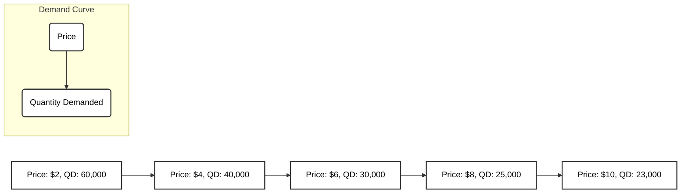

From: [[khanacademy]]   

In microeconomics, understanding the relationship between the price of a product and the quantity people are willing to buy is fundamental. This relationship is often illustrated using a demand schedule and a demand curve <a class="yt-timestamp" data-t="00:02:02">[00:02:02]</a>.

## The Law of Demand

The [[law_of_demand | law of demand]] is a core idea in microeconomics, stating that if the price of a product is raised, the [[impact_of_price_changes_on_quantity_demanded | quantity demanded]] for that product will generally decrease <a class="yt-timestamp" data-t="00:00:10">[00:00:10]</a>. Conversely, if the price is lowered, the [[impact_of_price_changes_on_quantity_demanded | quantity demanded]] will increase <a class="yt-timestamp" data-t="00:00:25">[00:00:25]</a>. While there are some exceptions, this principle generally holds true <a class="yt-timestamp" data-t="00:00:36">[00:00:36]</a>.

## Demand Schedule

A demand schedule is a table that displays the relationship between the price of a product and its [[impact_of_price_changes_on_quantity_demanded | quantity demanded]], assuming all other factors remain constant (*ceteris paribus*) <a class="yt-timestamp" data-t="00:02:06">[00:02:06]</a>. It's crucial to distinguish between "demand" (the entire relationship) and "quantity demanded" (an actual quantity at a specific price) <a class="yt-timestamp" data-t="00:01:10">[00:01:10]</a>.

Let's consider an example of an ebook called "Space Whatever":

| Scenario | Price ($) | Quantity Demanded (Units) |
| :------- | :-------- | :------------------------ |
| A        | 2         | 60,000                    |
| B        | 4         | 40,000                    |
| C        | 6         | 30,000                    |
| D        | 8         | 25,000                    |
| E        | 10        | 23,000                    |

This table, which shows how [[impact_of_price_changes_on_quantity_demanded | quantity demanded]] relates to price and vice versa, is known as a demand schedule <a class="yt-timestamp" data-t="00:04:05">[00:04:05]</a>. It illustrates the [[law_of_demand | law of demand]] by showing that as the price increases (from $2 to $10), the [[impact_of_price_changes_on_quantity_demanded | quantity demanded]] decreases (from 60,000 to 23,000).

## Demand Curve

A demand curve is a graphical representation of the demand schedule, providing a visual way to understand the [[understanding_demand_curve | understanding demand curve]] and the relationship between price and [[impact_of_price_changes_on_quantity_demanded | quantity demanded]] <a class="yt-timestamp" data-t="00:04:11">[00:04:11]</a>.

When [[graphing_the_demand_curve | graphing the demand curve]], it is conventional in economics to place price on the vertical axis and [[impact_of_price_changes_on_quantity_demanded | quantity demanded]] on the horizontal axis <a class="yt-timestamp" data-t="00:05:04">[00:05:04]</a>.

Here's how the "Space Whatever" ebook demand schedule can be plotted:

(Note: The mermaid graph above is a conceptual representation as direct plotting coordinates are not possible in Mermaid. In a true graph, the points would be plotted on a coordinate plane and connected.)

When these points (A-E) are plotted and connected, they form a continuous curve <a class="yt-timestamp" data-t="00:06:50">[00:06:50]</a>. This curve represents all possible scenarios, as prices can be set at any point, not just the discrete values in the schedule (e.g., $2.01 or $4.50) <a class="yt-timestamp" data-t="00:04:23">[00:04:23]</a>.

## Distinction: Demand vs. Quantity Demanded

It is critical to understand the [[difference_between_demand_and_quantity_demanded | difference between demand and quantity demanded]]:
*   **[[impact_of_price_changes_on_quantity_demanded | Quantity demanded]]** refers to the specific number of units people are willing to buy at a given price, with all other factors being equal <a class="yt-timestamp" data-t="00:07:16">[00:07:16]</a>. Changes in price cause movements *along* the existing demand curve <a class="yt-timestamp" data-t="00:07:51">[00:07:51]</a>.
*   **Demand** refers to the entire relationship between price and [[impact_of_price_changes_on_quantity_demanded | quantity demanded]], represented by the entire demand schedule or the entire demand curve <a class="yt-timestamp" data-t="00:07:30">[00:07:30]</a>. If demand itself were to change, it would mean the entire curve would shift, or the entries in the demand schedule would change <a class="yt-timestamp" data-t="00:07:39">[00:07:39]</a>. This occurs when factors other than price influence the relationship, which will be explored in future discussions <a class="yt-timestamp" data-t="00:08:09">[00:08:09]</a>.