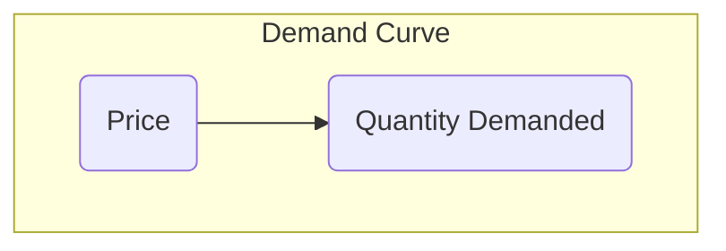

From: [[khanacademy]]   

In microeconomics, understanding the distinction between "demand" and "quantity demanded" is crucial for analyzing market behavior <a class="yt-timestamp" data-t="00:01:17">[00:01:17]</a>. While related, these terms describe different concepts concerning how consumers react to market conditions.

## The Law of Demand
The [[Law of demand in microeconomics | law of demand]] is a core idea in microeconomics, stating that if the price of a product increases, the [[Difference between quantity demanded and demand | quantity demanded]] for that product will decrease <a class="yt-timestamp" data-t="00:00:10">[00:00:10]</a>. Conversely, if the price of a product decreases, the [[Difference between quantity demanded and demand | quantity demanded]] will increase <a class="yt-timestamp" data-t="00:00:25">[00:00:25]</a>. This relationship generally holds true, though some exceptions exist <a class="yt-timestamp" data-t="00:00:36">[00:00:36]</a>.

## Quantity Demanded vs. Demand
It is important to formally distinguish between "demand" and "[[Difference between quantity demanded and demand | quantity demanded]]" in economics:
*   **Quantity Demanded** refers to a specific quantity of a product that people are willing to buy at a given price, assuming all other factors remain constant (ceteris paribus) <a class="yt-timestamp" data-t="00:01:11">[00:01:11]</a>, <a class="yt-timestamp" data-t="00:07:16">[00:07:16]</a>. Changes in price lead to changes in [[Difference between quantity demanded and demand | quantity demanded]] <a class="yt-timestamp" data-t="00:01:30">[00:01:30]</a>.
*   **Demand** refers to the *entire relationship* between various prices and the corresponding quantities demanded, assuming all other factors remain constant <a class="yt-timestamp" data-t="00:01:02">[00:01:02]</a>, <a class="yt-timestamp" data-t="00:07:30">[00:07:30]</a>. This relationship is captured by a [[Demand schedule and its significance | demand schedule]] or a [[Drawing and interpreting the demand curve | demand curve]] <a class="yt-timestamp" data-t="00:07:33">[00:07:33]</a>.

## Factors Influencing Quantity Demanded
The primary factor influencing a change in [[Difference between quantity demanded and demand | quantity demanded]] is a change in the product's **price** <a class="yt-timestamp" data-t="00:01:30">[00:01:30]</a>, <a class="yt-timestamp" data-t="00:07:51">[00:07:51]</a>. When only the price changes, consumers move *along* the existing [[Drawing and interpreting the demand curve | demand curve]] <a class="yt-timestamp" data-t="00:07:51">[00:07:51]</a>.

### Example: Ebook Sales
Consider the demand for an ebook:
| Scenario | Price ($) | Quantity Demanded (Thousands) |
| :------- | :-------- | :---------------------------- |
| A        | 2         | 60                            |
| B        | 4         | 40                            |
| C        | 6         | 30                            |
| D        | 8         | 25                            |
| E        | 10        | 23                            |
: A [[Demand schedule and its significance | demand schedule]] for an ebook <a class="yt-timestamp" data-t="00:02:02">[00:02:02]</a>.

This [[Demand schedule and its significance | demand schedule]] illustrates the [[Law of demand in microeconomics | law of demand]]: as the price increases, the [[Difference between quantity demanded and demand | quantity demanded]] decreases <a class="yt-timestamp" data-t="00:03:09">[00:03:09]</a>, <a class="yt-timestamp" data-t="00:03:14">[00:03:14]</a>, <a class="yt-timestamp" data-t="00:03:26">[00:03:26]</a>, <a class="yt-timestamp" data-t="00:03:39">[00:03:39]</a>, <a class="yt-timestamp" data-t="00:03:53">[00:03:53]</a>.

### Graphical Representation: The Demand Curve
A [[Drawing and interpreting the demand curve | demand curve]] graphically represents the [[Demand schedule and its significance | demand schedule]], plotting price on the vertical axis and [[Difference between quantity demanded and demand | quantity demanded]] on the horizontal axis <a class="yt-timestamp" data-t="00:05:10">[00:05:10]</a>. The curve connects all possible price-quantity demanded points, demonstrating a continuous relationship <a class="yt-timestamp" data-t="00:04:20">[00:04:20]</a>.

When only the price changes, a movement occurs *along* this curve. For example, moving from point A ($2, 60,000 units) to point B ($4, 40,000 units) on the curve represents a change in [[Difference between quantity demanded and demand | quantity demanded]], not a change in demand itself <a class="yt-timestamp" data-t="00:06:05">[00:06:05]</a>, <a class="yt-timestamp" data-t="00:06:13">[00:06:13]</a>.

## Factors Influencing Demand
Changes in factors *other than price* can lead to a shift in the entire demand relationship <a class="yt-timestamp" data-t="00:01:34">[00:01:34]</a>. This means the entire [[Drawing and interpreting the demand curve | demand curve]] shifts, or the entries in the [[Demand schedule and its significance | demand schedule]] change <a class="yt-timestamp" data-t="00:07:43">[00:07:43]</a>. When demand changes, it means that at any given price, a different quantity will be demanded. The specific factors that cause shifts in demand will be explored in subsequent discussions <a class="yt-timestamp" data-t="00:08:09">[00:08:09]</a>.

### Key Distinction Summary
*   **Change in [[Difference between quantity demanded and demand | quantity demanded]]**: Caused by a change in the product's **price**, resulting in a movement *along* the existing [[Drawing and interpreting the demand curve | demand curve]] <a class="yt-timestamp" data-t="00:07:51">[00:07:51]</a>, <a class="yt-timestamp" data-t="00:07:58">[00:07:58]</a>.
*   **Change in Demand**: Caused by a change in **other factors** (non-price determinants), resulting in the entire [[Drawing and interpreting the demand curve | demand curve]] *shifting* to a new position <a class="yt-timestamp" data-t="00:07:43">[00:07:43]</a>, <a class="yt-timestamp" data-t="00:08:12">[00:08:12]</a>.

[[Impact of price changes on supply and demand]]
[[Market dynamics and adjustments]]
[[Equilibrium price and quantity]]
[[Supply and demand curves for apples]]
[[Market shortages and surpluses]]