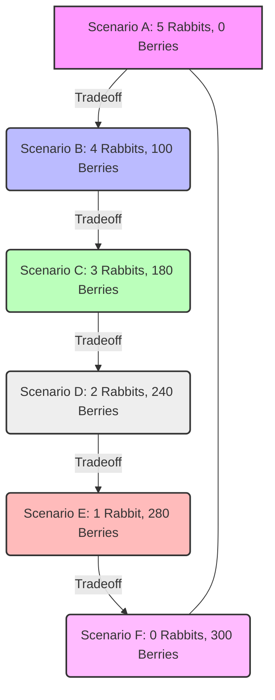

From: [[khanacademy]]   

In [[scarce_resources_and_economic_decision_making | economic decision making]], individuals or entities often face tradeoffs in how they allocate their limited resources. This concept can be illustrated through a simple model, such as a hunter-gatherer deciding how to spend their time <a class="yt-timestamp" data-t="00:00:02">[00:00:02]</a>.

## A Hunter-Gatherer Scenario

Consider a hunter-gatherer whose only options for acquiring food are hunting rabbits or gathering berries <a class="yt-timestamp" data-t="00:00:15">[00:00:15]</a>. The challenge is to decide how much time to spend on each activity <a class="yt-timestamp" data-t="00:00:05">[00:00:05]</a>.

To simplify the analysis, certain assumptions are made:
*   **Rabbits and Berries Only**: The only animal available for hunting is rabbits, and the only item for gathering is berries <a class="yt-timestamp" data-t="00:00:17">[00:00:17]</a>.
*   **Ceteris Paribus**: All other factors are held constant <a class="yt-timestamp" data-t="00:01:45">[00:01:45]</a>. This Latin phrase literally means "all other things equal" <a class="yt-timestamp" data-t="00:02:08">[00:02:08]</a>.
    *   This implies no change in total available time for hunting/gathering, no change in sleep patterns, no new techniques, no change in geography, and no new tools or technology <a class="yt-timestamp" data-t="00:01:33">[00:01:33]</a>.
    *   The only variable changing is the time allocated between finding rabbits and finding berries <a class="yt-timestamp" data-t="00:02:40">[00:02:40]</a>.

## Possible Scenarios

Various scenarios illustrate the tradeoffs between hunting and gathering, assuming an average daily output:

| Scenario | Rabbits (avg. per day) | Berries (avg. per day) | Description                                       |
| :------- | :--------------------- | :--------------------- | :------------------------------------------------ |
| A        | 5                      | 0                      | All time spent hunting <a class="yt-timestamp" data-t="00:00:45">[00:00:45]</a> |
| B        | 4                      | 100                    | More time for berries <a class="yt-timestamp" data-t="00:01:06">[00:01:06]</a>   |
| C        | 3                      | 180                    | Further time reallocation <a class="yt-timestamp" data-t="00:02:50">[00:02:50]</a> |
| D        | 2                      | 240                    | Decreased rabbit hunting time <a class="yt-timestamp" data-t="00:03:09">[00:03:09]</a> |
| E        | 1                      | 280                    | Minimal rabbit hunting time <a class="yt-timestamp" data-t="00:03:23">[00:03:23]</a> |
| F        | 0                      | 300                    | All time spent gathering <a class="yt-timestamp" data-t="00:03:48">[00:03:48]</a> |

These scenarios represent different allocations of time between the two activities <a class="yt-timestamp" data-t="00:02:41">[00:02:41]</a>.

## The Production Possibilities Frontier (PPF)

When these scenarios are plotted on a graph, with rabbits on one axis and berries on the other, they form a curve known as the [[production_possibilities_frontier | production possibilities frontier]] <a class="yt-timestamp" data-t="00:06:38">[00:06:38]</a>. This curve illustrates all the possible combinations of rabbits and berries that can be produced given the available resources and technology <a class="yt-timestamp" data-t="00:07:15">[00:07:15]</a>.

*   **Points on the Frontier**: Any point on the [[production_possibilities_frontier | curve]] itself (like Scenarios A-F) represents an [[efficiency_and_optimality_in_production | efficient]] allocation of resources <a class="yt-timestamp" data-t="00:10:38">[00:10:38]</a>. This means the hunter-gatherer is producing the maximum possible combination of goods with their available time <a class="yt-timestamp" data-t="00:10:43">[00:10:43]</a>. They are making the most use of their time <a class="yt-timestamp" data-t="00:10:55">[00:10:55]</a>.

*   **Points Outside the Frontier**: Any point beyond the [[production_possibilities_frontier | curve]] (e.g., 5 rabbits and 200 berries) is impossible to achieve with current resources and technology <a class="yt-timestamp" data-t="00:08:44">[00:08:44]</a>.

*   **Points Inside the Frontier**: Any point inside or below the [[production_possibilities_frontier | curve]] (e.g., 1 rabbit and 200 berries) is possible but not [[efficiency_and_optimality_in_production | optimal]] or [[efficiency_and_optimality_in_production | efficient]] <a class="yt-timestamp" data-t="00:09:49">[00:09:49]</a>. This suggests that resources are not being used to their full potential, or there is some inefficiency in production <a class="yt-timestamp" data-t="00:10:10">[00:10:10]</a>. For example, if a hunter-gatherer produces only 1 rabbit and 200 berries, they could produce more berries or more rabbits without sacrificing the other <a class="yt-timestamp" data-t="00:09:52">[00:09:52]</a>.