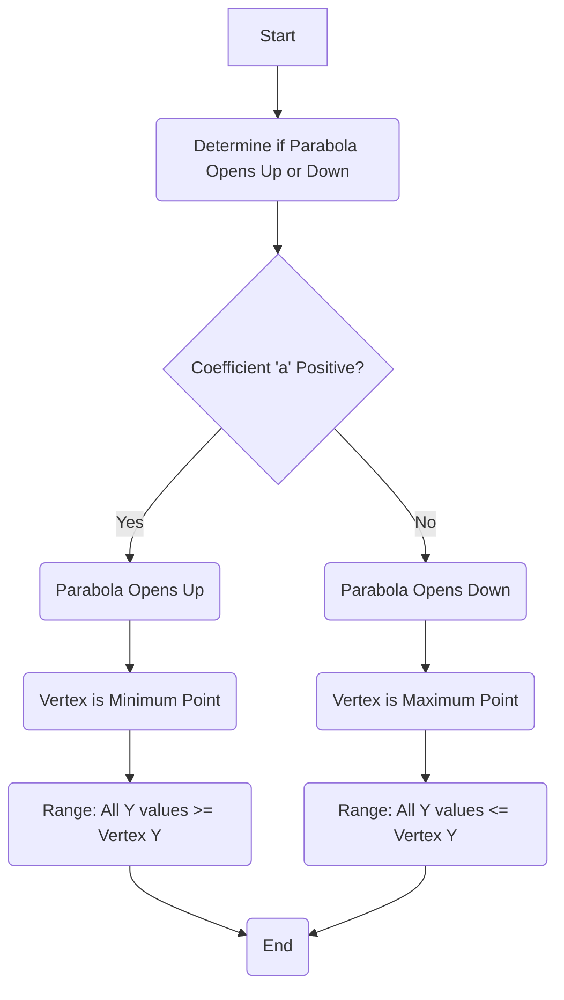

From: [[khanacademy]]   

The range of a function refers to the set of all possible output values, often represented as `f(x)` or `y` on a graph <a class="yt-timestamp" data-t="00:01:16">[00:01:16]</a>. For a [[graphing_quadratic_functions_and_identifying_their_parabolic_shape | quadratic function]], which forms a parabola, understanding its range is crucial.

## Parabolic Shape and Range

A [[graphing_quadratic_functions_and_identifying_their_parabolic_shape | quadratic function]] takes on a parabolic shape when graphed <a class="yt-timestamp" data-t="00:01:38">[00:01:38]</a>. The direction a parabola opens dictates whether its vertex represents a minimum or maximum output value:
*   An "upward opening" parabola will not produce any values below its vertex <a class="yt-timestamp" data-t="00:01:51">[00:01:51]</a>.
*   A "downward opening" parabola will not produce any values above its vertex <a class="yt-timestamp" data-t="00:01:55">[00:01:55]</a>.

The vertex is the point at which the parabola changes direction, establishing either the lowest or highest point the function's output can reach <a class="yt-timestamp" data-t="00:07:03">[00:07:03]</a>.

## Determining the Range

To determine the range of a quadratic function, one must find the coordinates of its vertex. The x-coordinate of the vertex can be found using the formula:
`x = -b / (2a)` <a class="yt-timestamp" data-t="00:02:16">[00:02:16]</a>

This formula is derived directly from the [[introduction_to_the_quadratic_formula | quadratic formula]], which itself is obtained by [[converting_a_quadratic_equation_into_a_perfect_square | completing the square]] <a class="yt-timestamp" data-t="00:02:18">[00:02:18]</a>.

Once the x-coordinate of the vertex is known, substitute it back into the original quadratic function to find the corresponding y-coordinate, which is the minimum or maximum value of the range.

### Example: f(x) = 3x² + 6x - 2

Let's determine the range for the function `f(x) = 3x² + 6x - 2` <a class="yt-timestamp" data-t="00:00:02">[00:00:02]</a>.

1.  **Identify coefficients**: For `f(x) = ax² + bx + c`, we have `a=3`, `b=6`, `c=-2`.
2.  **Find the x-coordinate of the vertex**:
    `x = -b / (2a) = -6 / (2 * 3) = -6 / 6 = -1` <a class="yt-timestamp" data-t="00:03:14">[00:03:14]</a>
3.  **Find the y-coordinate of the vertex**: Substitute `x = -1` into the function:
    `f(-1) = 3(-1)² + 6(-1) - 2` <a class="yt-timestamp" data-t="00:02:53">[00:02:53]</a>
    `f(-1) = 3(1) - 6 - 2` <a class="yt-timestamp" data-t="00:02:59">[00:02:59]</a>
    `f(-1) = 3 - 6 - 2` <a class="yt-timestamp" data-t="00:03:07">[00:03:07]</a>
    `f(-1) = -3 - 2 = -5` <a class="yt-timestamp" data-t="00:03:10">[00:03:10]</a>

Therefore, the vertex is at `(-1, -5)` <a class="yt-timestamp" data-t="00:03:10">[00:03:10]</a>.

Since the coefficient `a` (which is 3) is positive, the parabola opens upwards <a class="yt-timestamp" data-t="00:01:43">[00:01:43]</a>. This means the vertex `(-1, -5)` represents the minimum point of the function <a class="yt-timestamp" data-t="00:07:05">[00:07:05]</a>.

*   The function can get as low as -5 <a class="yt-timestamp" data-t="00:07:16">[00:07:16]</a>.
*   As x values move away from the vertex (either increasing to the right or decreasing to the left), the parabola goes upwards <a class="yt-timestamp" data-t="00:07:22">[00:07:22]</a>.
*   Thus, `f(x)` will never be less than -5 <a class="yt-timestamp" data-t="00:07:32">[00:07:32]</a>.

The range of `f(x) = 3x² + 6x - 2` is all real numbers greater than or equal to -5 <a class="yt-timestamp" data-t="00:07:52">[00:07:52]</a>.

## Graphical Interpretation

Graphing the function helps visualize the range. The parabola for `f(x) = 3x² + 6x - 2` looks like this:
*   Points plotted: `(-2, -2)`, `(-1, -5)`, `(0, -2)`, `(1, 7)` <a class="yt-timestamp" data-t="00:05:23">[00:05:23]</a>
*   The lowest point on the graph is the vertex `(-1, -5)` <a class="yt-timestamp" data-t="00:05:56">[00:05:56]</a>.
*   From this minimum y-value, the graph extends infinitely upwards <a class="yt-timestamp" data-t="00:07:37">[00:07:37]</a>.

## Domain of a Quadratic Function

While discussing range, it's worth noting that the [[understanding_the_domain_of_a_quadratic_function | domain of a quadratic function]] is always all real numbers <a class="yt-timestamp" data-t="00:00:30">[00:00:30]</a>. This is because any real number can be substituted into the function `f(x) = ax² + bx + c` without causing mathematical undefinedness (e.g., division by zero or square roots of negative numbers) <a class="yt-timestamp" data-t="00:00:16">[00:00:16]</a>.